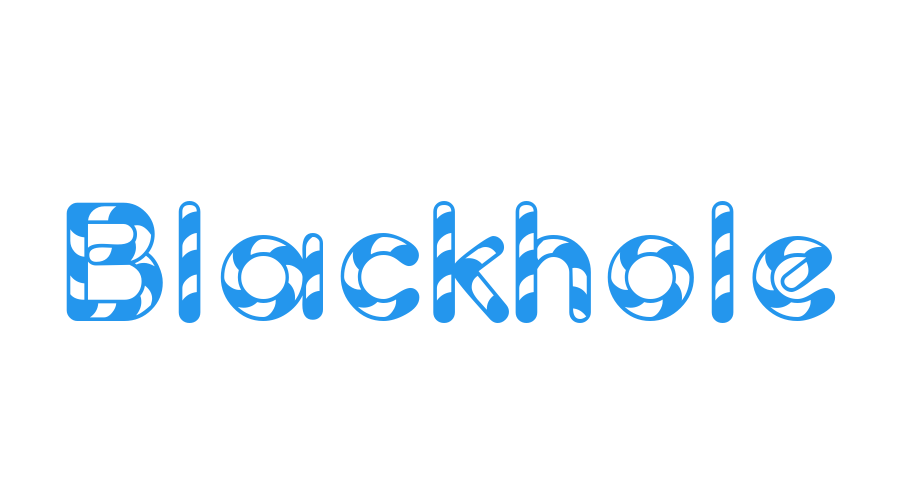
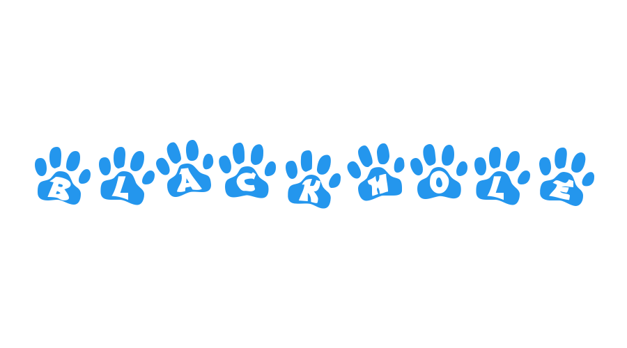
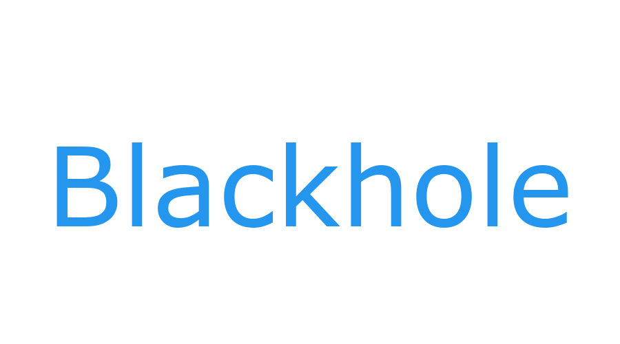

# black hole

黑洞图片生成器，协助生成微信公众号头图。 自由不侵权，game404 出品。

```
  ____   _               _     _             _
 | __ ) | |  __ _   ___ | | __| |__    ___  | |  ___
 |  _ \ | | / _` | / __|| |/ /| '_ \  / _ \ | | / _ \
 | |_) || || (_| || (__ |   < | | | || (_) || ||  __/
 |____/ |_| \__,_| \___||_|\_\|_| |_| \___/ |_| \___|

```

## 使用方法

### python使用

1. 安装 **pipenv**

2. 安装包 `pipenv install`

3. 执行 

```
python blackhole.py --word python
```

4. 更多查看帮助

```
(pywork-Y7-meC5z) C:\pywork\blackhole>python blackhole.py --help
Usage: blackhole.py [OPTIONS]

  黑洞图片生成器，协助生成微信公众号头图。自由不侵权，game404 出品。

  python运行示例:

      python blackhole.py --word docker

      python blackhole.py --word docker --bcolor black --fcolor #ffffff

      python blackhole.py --word docker --fpath some.ttf

  Docker运行示例:

      docker run -it --rm game404/blackhole docker

      ...

Options:
  --word TEXT    图片文字
  --bcolor TEXT  图片背景色，默认白色，支持颜色值['red', 'cyan', 'green', ...]及rgb hex值#ffffff
  --fcolor TEXT  文字颜色，默认docker蓝，支持颜色值['red', 'cyan', 'green', ...]及rgb
                 hex值#ffffff
  --fpath TEXT   字体文件路径，默认空，使用预制字体。也许相对路径更合适。
  -h, --help     Show this message and exit.
```

### docker使用

```
--word docker
```

### 效果图

电脑

虎尾

熊爪

像素风

楷体像素风


## 参考项目

* [click命令行](https://github.com/pallets/click)
* [英文字体库](https://www.fontpalace.com)